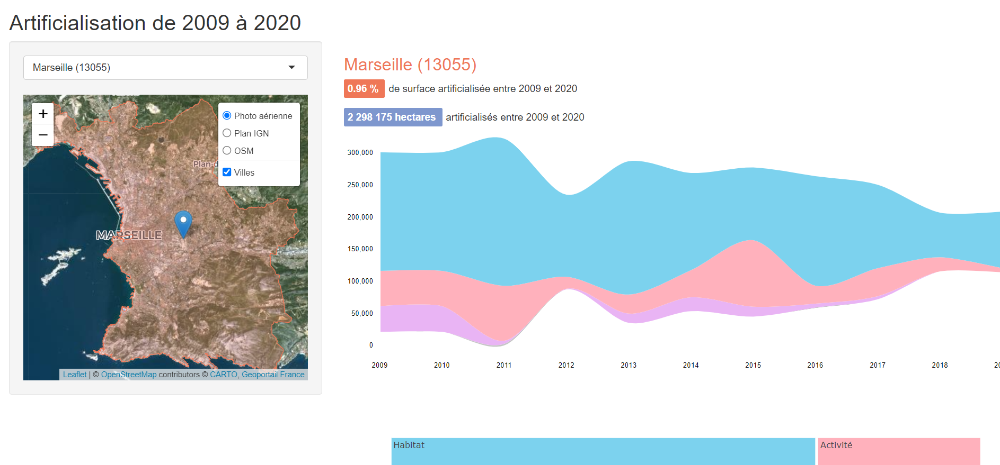

# Appli Shiny sur l'artificialisation

Accéder à l'application : https://datagistips.shinyapps.io/artif0920/

## Installation
Préambule :

1. Installer [R](https://cran.r-project.org/bin/)
2. Installer [RStudio](https://www.rstudio.com/products/rstudio/download/)
1. Télécharger l'application ici présente :

		git clone https://github.com/datagistips/shiny-artif-app.git

2. Ouvrir [RStudio](https://www.rstudio.com/products/rstudio/download/#download)
3. Ouvrir le script `app.R`
4. Cliquer sur **Run**

## Tuto
👉 [Accéder au notebook expliquant la création de l'application Shiny](https://github.com/datagistips/shiny-artif/blob/master/notebooks/8-notebook-shiny.Rmd) | [version HTML](https://github.com/datagistips/shiny-artif/blob/master/notebooks/8-notebook-shiny.html)

